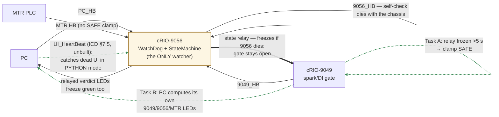

# Heartbeat hardening — click-level build instructions

*Created 2026-07-17. Closes the holes found by the 2026-07-16 kill-9056 test
(`docs/command-path-asbuilt.md` §6a) and the inert-mirror suspicion. Three tasks on
three targets, independent of each other — do A first (protection), then B
(observability), then C (mirror). Heartbeat-map recap: the 9056 watches everyone
(including itself); the 9049 watches nobody cross-chassis; the PC computes nothing.*

**Stop the running system before any edit (you cannot edit a running VI); log
build/deploy times in the commissioning book. Every task ends with its own
verification — do not skip them.**

## Heartbeat flow schematic

Solid = exists · dashed = to add (Tasks A/B + `UI_HeartBeat`).

**The point:** every solid watching-arrow ends at one chassis — the watcher has no
watcher (proven by the 2026-07-16 kill-9056 test: LEDs froze green, the 9049 kept
gating on stale state).

## Task A — 9049 staleness→SAFE clamp on the state relay (`APC_9049_CAS_loop.vi`)
### ✅ BUILT + VERIFIED 2026-07-17 (kill-9056 at FIRING → spark/DI blocked; H1/H2 closed)

**Closes:** 9056 dies at state ≥ 2 → `9049_Global_SYSTEMSTATE` freezes → spark/DI gate
stays open on stale state (observed live 2026-07-16 → **no longer true as of this build**).
Side-observation from the verify: `UI_Main` still displayed FIRING throughout (frozen
`SystemState_SM`) → drove Task B step 6.

1. In the project (RT target context) open **`APC_9049_CAS_loop.vi`** → block diagram.
2. Find the **`APC_9049_9056SharedVarPolling`** subVI call (it returns the 9056 IO
   array + **timestamp** + `SystemState`) and follow the `SystemState` wire to where
   the loop **writes `9049_Global_SYSTEMSTATE`**.
3. Build the staleness detector — **time-based, not cycle-based** (CAS iterates once
   per engine cycle, so a cycle counter would scale with rpm; ms don't):
   a. Drop a **Tick Count (ms)** primitive in the loop.
   b. Wire the polling VI's **timestamp** into a **Feedback Node**; compare current vs
      previous (**Not Equal?**).
   c. **Select** node: timestamp changed → store the current Tick Count ("last-fresh
      time", second Feedback Node); unchanged → keep the stored value.
   d. **Subtract**: now − last-fresh → **> 5000** (ms, diagram constant with a comment:
      "9056 staleness threshold — matches the WatchDog ~5 s convention").
4. Feed the resulting `9056 stale?` boolean into a **Select** on the state wire:
   TRUE → **DBL constant −1** (not I8 — as-built `9049_Global_SYSTEMSTATE` is a
   **DBL**, and matching it avoids a coercion dot on a safety-path wire), FALSE →
   the relayed `SystemState` (also DBL, out of the `9056_MeasAndCalc` DBL array) →
   into the `9049_Global_SYSTEMSTATE` write. No coercion dots anywhere on the Select.
5. Surface the boolean: front-panel indicator **`9056 stale (relay clamped)`** on
   CAS_loop, so interactive sessions can see the clamp acting.
6. Save. **This is a state-path change, not display-only** — regression required
   (below). Rebuild **both** rtexe specs (`APC_9049_RT` and `APC_9049_RT SIM`) when
   done; log both on the deployment sheet.

*Verify:* interactive, sim crank + sim pressure, state = 2, gate LEDs lit → **kill the
9056** → within ~5 s: `9056 stale` TRUE, `9049_Global_SYSTEMSTATE` = −1 (DSM), **gate
LEDs dark, `NumberOfActiveIGN_DI` collapses**. Restart the 9056 (reboot-order rules)
→ relay resumes, state recoverable. *Regression:* re-run the state-gate checks
(4d LEDs on/off with state) and drill 5i; the warnings matrix is untouched by this
edit — no matrix re-run needed.

*Known residual (pre-existing, unchanged):* if CAS_loop itself dies, the echo freezes
— TS10ms still gates on the last value. The FPGA watchdog covers a full RT stall;
a CAS-only death remains uncovered (documented gotcha #5 in the codebase README).

---

## Task B — PC-computed watchdog LEDs (`APC_PC_UI_Main.vi`)

**Closes:** the UI's liveness LEDs are relayed 9056 verdicts that freeze green when
the 9056 dies (operator decision 2026-07-16: compute liveness on the PC).

1. Open **`APC_PC_UI_Main.vi`** → block diagram; find the main polling loop (the one
   that reads shared variables for display) and note its **loop period** (needed for
   the threshold; if it's ~100 ms, the 5 s threshold = 50 iterations — but prefer the
   same Tick-Count-ms pattern as Task A, immune to period changes).
2. Add SV reads of **`9049_HeartBeat`** and **`9056_HeartBeat`** (they live in the
   9049-hosted `APC_SharedVars` — no new deployment needed).
3. Per channel, the stall detector (same as Task A steps 3–4): Feedback Node on the
   value → changed? → refresh last-fresh Tick Count → (now − last-fresh) > 5000 ms →
   boolean → new front-panel LED. Labels: **`9049 not responding (PC view)`**,
   **`9056 not responding (PC view)`**.
4. **MTR LED from first-hand knowledge:** the PC is the Modbus master — in the Modbus
   loop, the comms-loss branch (the wait-5 s-and-retry case) sets a boolean → LED
   **`MTR link down (PC view)`**. (Alternative: stall-count the MTR HB register with
   the same pattern.)
5. **Keep** the existing `9056_PCnotResponding` LED, relabeled **`PC HB fault (9056
   view)`** — it is the only external check on the PC's own heartbeat path. Remove or
   demote the old relayed `9056_9049notResponding` / `9056_MTRnotResponding` LEDs to
   avoid two sources of truth on one panel. Group the new LEDs under a header:
   **"LIVENESS (computed on this PC)"**.
6. **State display honesty** (added after the 2026-07-17 Task-A test: with the 9056
   dead, `UI_Main` kept showing FIRING while the engine was really clamped at −1).
   As-built source (confirmed 2026-07-17): the displayed state is the `SystemState`
   element of **`APC_PC_VariableMapping`**'s output cluster, filled **by name from
   `9056_MeasAndCalc`** (9056 wins name collisions) — so it freezes with the chassis,
   **as does every other 9056-sourced value the router serves to the panel**:
   a. **Displayed state = Min(mapped `SystemState`, `9049_Global_SYSTEMSTATE`)**
      (operator design, 2026-07-17): where `UI_Main` unbundles `SystemState` from the
      VariableMapping / `APC_VisualizationCluster_v2` output, add a direct SV read of
      `9049_Global_SYSTEMSTATE` (both DBL) → **Min** → the state indicator. The
      effective state IS the min of the two (9049 gates on the echo, 9056 controllers
      on the SM state), so this shows the most restrictive truth with no liveness
      plumbing: 9056 dies → echo self-clamps (Task A) → display drops to −1
      automatically. **Depends on Task A being deployed** — pre-clamp, both sources
      froze together and Min would display stale FIRING too.
   b. **The "why" banner:** Min shows −1 without saying whether it's a commanded SAFE
      or a dead 9056 — the step-3 `9056 not responding (PC view)` LED drives a
      panel-level red **"9056 DOWN — data stale"** banner (one banner, not
      per-indicator gating: with the 9056 dead, *every* VariableMapping-served value
      on the panel is frozen — temps, flows, rasters).
   c. **Mismatch alarm — now essential, not optional:** Min deliberately hides
      divergence (it always shows the lower source), so a sustained mismatch is the
      only reveal for a relay stuck low, a CAS-only death, or a future regression
      (README gotcha #5's recommendation). Build, in the same display loop as 6a
      (both values are already on the diagram there):
      1. **Compare:** Subtract the two DBLs (mapped `SystemState` −
         `9049_Global_SYSTEMSTATE`) → **Absolute Value** → **> 0.5** → `mismatch?`
         boolean. (Don't use Equal? on DBLs — the values are integral −1..3 today,
         but |Δ| > 0.5 is immune to any float fuzz forever.)
      2. **"Last time they agreed" memory:** drop a **Tick Count (ms)**; wire a
         **Select**: `mismatch?` FALSE → current Tick Count, TRUE → the stored value
         from a **Feedback Node** whose output loops back into the Select's TRUE
         input (the classic sample-and-hold).
      3. **Initialize the Feedback Node** (its ▸ initializer terminal) from a **Tick
         Count (ms) placed OUTSIDE the loop** — otherwise it inits to 0 and a boot
         transient where the states briefly differ fires a false alarm (now − 0 is
         huge).
      4. **Sustained test:** current Tick Count − stored "last-agreed" → **> 3000**
         (ms, diagram constant, comment: "sustained SM≠echo — README gotcha #5") →
         amber LED **`STATE MISMATCH (SM ≠ 9049 echo)`**, placed in the "LIVENESS
         (computed on this PC)" group.
      5. **Non-latching by design** — it's a live condition, not an event log; it
         clears itself when the sources re-agree. (If a latched record is ever
         wanted, OR it into a feedback latch with a manual reset — not now.)
      *Verify both directions:* (pass) climb the ladder normally — the ~1-cycle relay
      lag must NOT light it (133 ms ≪ 3 s); (fire) with Task A deployed, kill the
      9056 at state ≥ 2 → after ~5 s the echo clamps to −1 while the mapped value
      stays frozen high → ~3 s later the LED lights, alongside the banner. That
      kill-test now exercises banner, Min display, and mismatch LED in one shot —
      the drill-5i photograph.
   d. **Fold the liveness verdicts into the Min** (added after the 2026-07-17 Task-B
      test: killing the **9049** at FIRING lit the `9049 not responding` LED but the
      display stayed at 3 — the 9049 is the **SV host**, so on its death *every* SV
      freezes: echo stuck at 3, `9056_MeasAndCalc` stuck too, Min(3,3)=3; the PC's
      own stall detectors are the only first-hand data left). Extend the display:
      1. `9049 not responding (PC view)` (step 3) → **Select**: TRUE → **DBL −1**,
         FALSE → **DBL 3** (3 = the state ceiling, neutral inside a Min).
      2. Same for `9056 not responding (PC view)` (belt-and-suspenders — the display
         then doesn't depend on Task A for the 9056 case).
      3. Chain the two into the 6a Min (two more Min nodes, or Build Array → Array
         Max & Min → min output): **displayed = Min(mapped, echo, sel49, sel56)**.
      4. The `9049 DOWN` case also gets a panel banner like 6b's — arguably the
         bigger one: **"9049 DOWN — ALL panel data stale"** (the SV host is gone;
         every value on screen is frozen). Reality is safe when it fires — no RT
         toggling ⇒ the FPGA watchdog has killed spark/DI in hardware — the banner
         is about the screen, not the engine.
      *Verify:* kill the 9049 just after reaching state 3 → within ~5 s: LED red,
      **displayed state −1**, banner up (everything else on the panel visibly
      frozen). Restart per reboot-order rules (9049 first — it hosts the SVs).
7. Save; **rebuild the PC EXE** (PC apps run as EXEs only — deployed-bringup rule #1);
   log the build.

*Verify:* run everything → kill the 9056 → `9056 not responding (PC view)` red within
~5 s **while the old-style relayed values freeze** (photograph: this is the drill-5i
before/after evidence). Restart; repeat once for the 9049 (expect the 9049 LED red +
UI SVs stale — the SV host is the 9049, so much of the panel dies with it; note what
the LED adds anyway: an explicit verdict instead of quietly frozen numbers).
> ✅ **Task B BUILT + VERIFIED 2026-07-17/18** incl. step 6 (Min display + banners +
> mismatch alarm + liveness-folded Min): kill-9056 and kill-9049 both show honest
> LEDs, displayed state −1, banner. **Threshold tuning (open):** 5 s felt long to the
> operator; before dropping to 1 s, MEASURE first — add a temporary max-gap indicator
> (`Max(now − last-change)` feedback) per heartbeat, run ~30 min incl. network abuse
> (deploy, DSM open, file copy to cRIO), then set **threshold = worst gap × 3–5**.
> Split by SIGNAL RATE, not just cost (corrected 2026-07-18 after the kill-at-12 test
> showed 5 s of continued spark/DI scheduling — **there is NO local protection against
> loss-of-supervisor**; CylPressError/FPGA-watchdog/sync-loss only cover combustion,
> RT-death, and encoder hazards):
> - **Task A** input = the `9056_MeasAndCalc` timestamp, updating every TS_loop pass
>   (~20–50 ms) — measure ITS worst gap; if ≤ ~200–300 ms, **~1 s threshold is sound**
>   (3–5× worst gap, 20–50× update period) and cuts the unsupervised-firing tail 5×.
> - **Task B** LEDs watch ~2 Hz heartbeats — their floor is higher (~2 s realistic);
>   a false trip is only a banner, but a threshold below a few toggle periods flickers.
> Rule either way: threshold = worst measured gap × 3–5. Context: 9056 WatchDog ~5 s,
> Python staleness 3 s. Fueled-scenario mitigation during any residual window: the
> 9056's own FPGA RT-stall safe-hold closes plant outputs (incl. gas feeds) in ~1 s,
> so continued spark burns down a dying charge, not a sustained supply.

---

## Task C — gateway `operator_requests` (make the safety mirror real)

**Closes:** the Python safety-only mirror is inert if telemetry lacks
`operator_requests` (the mirror returns early on `None`) — panel FORCE buttons then
have **no** Python-mode path. The Python side is already built: `monarch_parser` maps
an `operator_requests` flatten via `control_settings_from_labview` — the gateway just
has to send it.

0. **Verify it's actually missing first** (2 min): open `operate_traffic.jsonl` on the
   control PC → any telemetry line → is there an `"operator_requests"` key? If present
   and non-null, Task C is already done — skip to Verify.
1. Open **`APC_PC_PythonGateway.vi`** → the 1000 ms telemetry frame section (where
   `settings` / `limited_settings` are built from `Flatten To JSON` of
   `PC_ControlSettings` + the `Limited_ControlSettings` tap).
2. Add an SV read of **`PC_OperatorRequests`** → **Flatten To JSON** (same instance
   pattern as `PC_ControlSettings`) → insert into the telemetry JSON as field
   **`operator_requests`** (exact key, snake_case).
3. Save; rebuild/redeploy the gateway EXE; log it.

*Verify (the mirror test, PYTHON mode + `--safety-only-mirror`):*
1. `operate_traffic.jsonl` now shows `operator_requests` populated each second.
2. Press **FORCE MOTORING** on the panel → state clamps to ≤1 within a tick or two →
   release → ladder climbs again. That is the panel-force safety floor working through
   Python for the first time. Record in the book (it upgrades the 4c e-stop-only
   verification to the full safety floor).

---

## Order, custody, and where this reports

- Recommended order: **A → B → C**; re-run **drill 5i** after A+B for the
  before/after evidence page.
- Builds touched: 9049 rtexe ×2 specs (A), PC UI EXE (B), gateway EXE (C) — one
  deployment-sheet line each, SIM/safe-defaults distinction maintained.
- On completion update: `docs/command-path-asbuilt.md` §6a (mark tasks built),
  the heartbeat-map holes list, and `docs/session-handoff-2026-07-11.md`.
